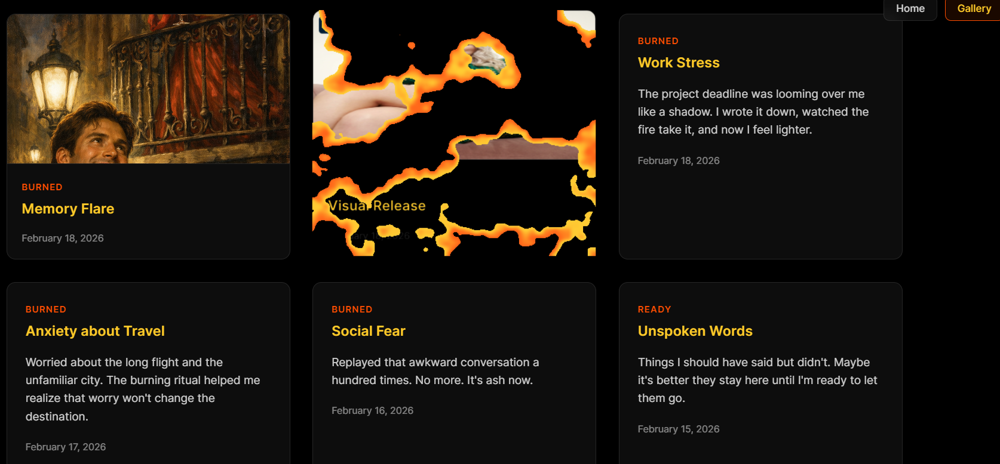

# Burning Effects

A premium, WebGL-powered text and DOM element burning effect. This project features a meditative "burn it" experience for your thoughts and a gallery of burned memories.

## Features
- **Meditative Burn**: Write your thoughts and watch them consume into ash with a stunning WebGL fire effect.
- **Gallery Page**: View a collection of burned cards, including support for images.
- **WebGL Shaders**: Custom GLSL shaders for realistic fire, dissolution, and atmospheric effects.
- **Glassmorphism**: Modern, premium UI with backdrop blurs and subtle transparency.
- **Persistent State**: The burning progress is saved using `localStorage`.

## Examples

## Tech Stack
- HTML5 / Vanilla JavaScript
- WebGL / GLSL Shaders
- [html2canvas](https://html2canvas.hertzen.com/) (for DOM-to-texture conversion)

## Installation
Simply open `index.html` in your browser. No server required for basic functionality, though some browser features might require a local dev server (like Live Server extension).
## Thanks to CodePen Home
Burning ‍🔥 DOM element with WebGL by Ksenia Kondrashova
https://codepen.io/ksenia-k/pen/yLQLyZa
---
*Created with focus on visual excellence and premium aesthetics.*
